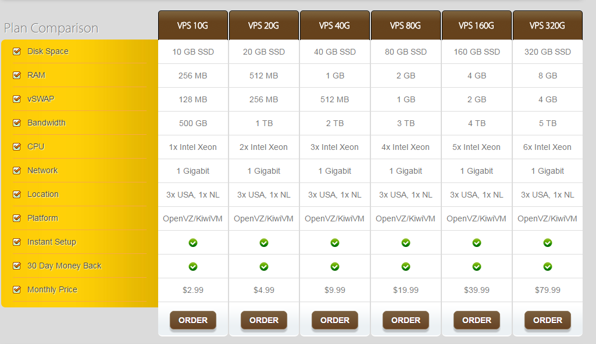
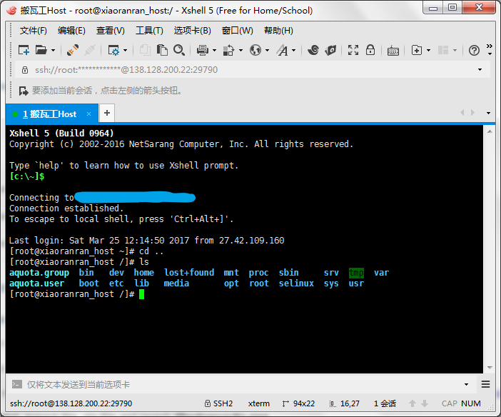
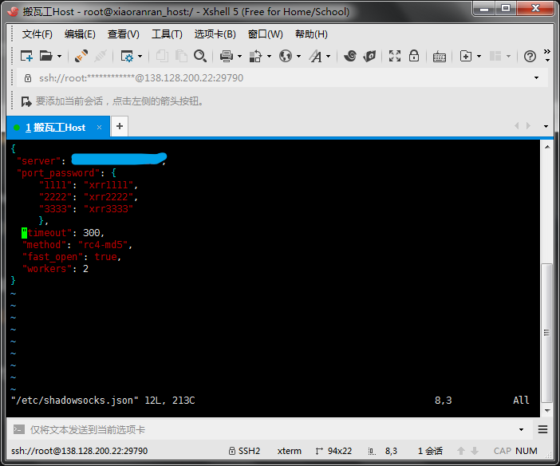
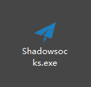
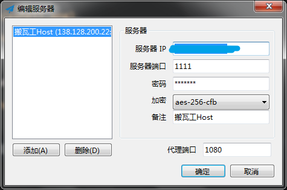

# Over The Wall

记录如何通过搭建Shadowsocks服务器实现科学上网

第1步 购买一台国外的VPS主机[搬瓦工云主机](https://bwh1.net/), 选年付$19.9的方案, 加上优惠码*IAMSMART5Q74B8* 节省5%.

第2步 使用Xshell登录主机, 安装需要的软件服务端Shadowsocks, 编写Shadowsocks配置文件

第3步 下载客户端Shadowsocks, Chrome插件SwitchOmega

第4步 本地Shadowsocks启用代理

(待续...)
